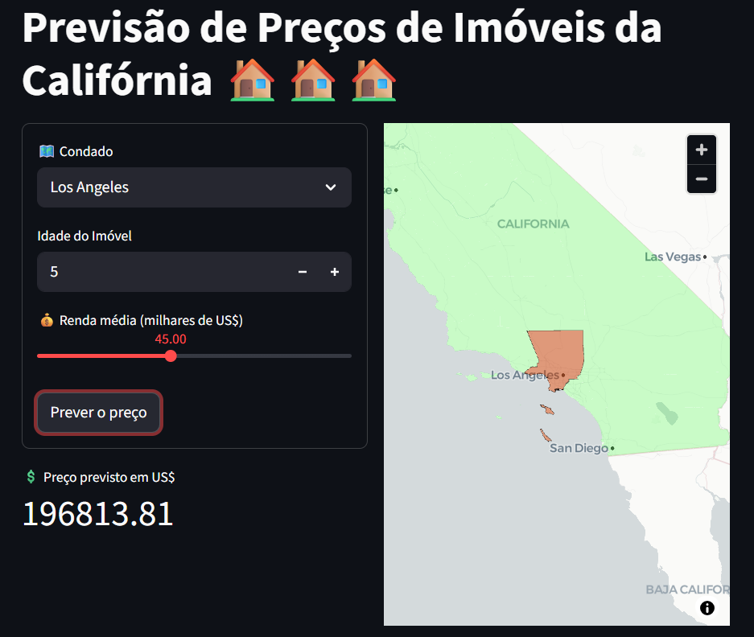

# Previsão de preços de imóveis do estado da Califórnia

Através de uma base de dados retirada do Kaggle, fiz um projeto dividido em algumas etapas:
- Análise Exploratória de Dados (EDA)
- Mapas com Seaborn
- GeoPandas e Visualizações
- Machine Learning
- Criação de um app com streamlit

**Origem dos dados:** https://www.kaggle.com/datasets/camnugent/california-housing-prices/data
**Link do app:** https://previsaoprecoscaliforniagit-ku7w.streamlit.app/

## Um pouco sobre a base
Este conjunto de dados foi extraído do censo dos Estados Unidos de 1990 e está estruturado com uma linha para cada grupo de blocos censitários. Um grupo de blocos representa a menor unidade geográfica para a qual o Escritório do Censo divulga dados amostrais, geralmente abrangendo populações entre 600 e 3.000 pessoas.
No contexto do conjunto, um *household* (domicílio) refere-se a um grupo de pessoas que vive na mesma residência. Como as variáveis de média de cômodos e quartos são calculadas por domicílio, é possível encontrar valores elevados em regiões com poucos domicílios ocupados e muitas residências vazias, situação comum em áreas turísticas ou de veraneio.

## Organização do projeto
- .gitignore         <- Arquivos e diretórios a serem ignorados pelo Git
- ambiente.yml       <- O arquivo de requisitos para reproduzir o ambiente de análise
- LICENSE            <- Licença de código aberto (MIT)
- README.md          <- README principal para desenvolvedores que usam este projeto.

- dados              <- Arquivos de dados para o projeto.
- notebooks          <- Jupyter Notebooks.
  - auxiliares.py  <- Funções para ajudar na visualização de dados 
  - config.py    <- Configurações básicas do projeto
  - graficos.py  <- Funções para criação de gráficos personalizados
  - modelos.py  <- Funções para criação de modelos usados no projeto      

## Imagem do app finalizado
